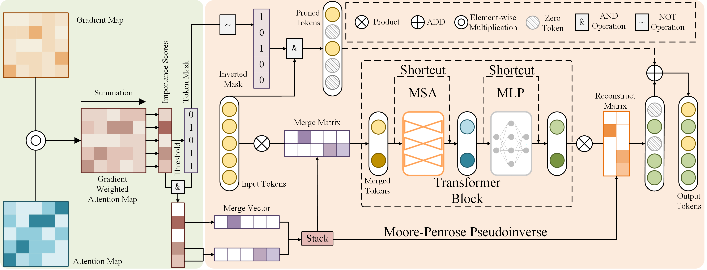

# Prune and Merge: Efficient Token Compression For Vision Transformer With Spatial Information Preserved 

This repository contains PyTorch evaluation code, pruning code, finetuning code, and pruned models of our method for DeiT:
 
The framework of our Prune and Merge:



The implementation on Segmenter is in this [link](https://github.com/wafev/PM-Segmenter)

# Model Zoo

We provide baseline DeiT models pretrained on ImageNet 2012 and the pruned model.

| name | keep rate |acc@1 | FLOPS | Throghput | url |
| ---  | ---       |  --- | --- | --- | --- |
| DeiT-tiny | |72.2 | 1.3 | 2234 | [model](https://dl.fbaipublicfiles.com/deit/deit_tiny_patch16_224-a1311bcf.pth) |
| DeiT-small | |79.8 | 4.6 | 1153| [model](https://dl.fbaipublicfiles.com/deit/deit_small_patch16_224-cd65a155.pth) |
| DeiT-base | |81.8 | 17.6 | 303 | [model](https://dl.fbaipublicfiles.com/deit/deit_base_patch16_224-b5f2ef4d.pth) |
| PM-ViT-tiny |0.7 |72.0 | 0.8 | 3375 | [model](https://drive.google.com/file/d/1r12PcIiuAf0Wkshe4nyuFFsmS2zasqcz/view?usp=drive_link) |
| PM-ViT-tiny | 0.6 | 71.6|0.7 | 3745 | [model](https://drive.google.com/file/d/1X2e54Xef84xQGCBjXmIcwhoCjF2qNTZN/view?usp=drive_link) |
| PM-ViT-small | 0.6|79.6  | 3.0 | 1793 | [model](https://drive.google.com/file/d/1-7m2xyOJ-wV-TNENDIrymxiE5L4teoQQ/view?usp=drive_link) |
| PM-ViT-MAE-base |0.6 |83.6  | 10.4 | 505 | [model](https://drive.google.com/file/d/1JpWCTZaScTls79pgetF7KNOWye95Ormt/view?usp=drive_link) |

# Usage

First, clone the repository locally:
```
git clone https://github.com/wafev/prune_and_merge.git
```
Then, create the conda environment and install PyTorch 1.10.1+ and torchvision 0.11.2+ and [pytorch-image-models 0.3.2](https://github.com/rwightman/pytorch-image-models):

```
conda create --n pmvit python==3.7
conda install pytorch==1.10.1 torchvision==0.11.2 -c pytorch
pip install timm==0.3.2
```

## Data Preparation

Download and extract ImageNet train and val images from http://image-net.org/.
The directory structure is the standard layout for the torchvision [`datasets.ImageFolder`](https://pytorch.org/docs/stable/torchvision/datasets.html#imagefolder), and the training and validation data is expected to be in the `train/` folder and `val` folder respectively:

```
/path/to/imagenet/
  train/
    class1/
      img1.jpeg
    class2/
      img2.jpeg
  val/
    class1/
      img3.jpeg
    class/2
      img4.jpeg
```

## Evaluation
To evaluate a pruned DeiT-Tiny on ImageNet val with a single GPU run:
```
python pm-vit/finetune.py --eval --model tmvit_tiny_patch16_224  --batch-size 256 --data-path /path/to/imagenet --resume /path/to/checkpoint.pth
```

For Throughput test, run:
```
python pm-vit/finetune.py --speed-only --model tmit_tiny_patch16_224  --batch-size 256 --data-path /path/to/imagenet --resume /path/to/checkpoint.pth
```

Note that the resume path is necessary because the pruning setting is saved in the checkpoint. 

## Pruning

For compressing DeiT-Tiny without finetuning, run:
```
python pm-vit/finetune.py --prune --model tmit_tiny_patch16_224 \
--resume /path/to/pre-trained/model --data-path path/to/imagenet \
--batch-size 256 --prune_mode attn --prune_rate 0.1 --keep_rate 0.6 \
--mixup 0 --reprob 0 --cutmix 0 
```
## Finetuning

To finetune the pruned DeiT-small and Deit-tiny on ImageNet on a single node with 2 gpus for 30 epochs run:

DeiT-Tiny
```
python -m torch.distributed.launch --nproc_per_node=2 --use_env \
pm-vit/finetune.py --model tmit_tiny_patch16_224 --batch-size 256 --data-path /path/to/imagenet \
--resume /path/to/pruned/model \
--teacher-path  /path/to/pretrained/model \
--teacher-model deit_tiny_patch16_224 --distillation-type soft \
--prune_mode attn --final_finetune 60  \
--batch-size 256 --lr 1e-4 --weight-decay 0.001 --distillation-alpha 0.8 --distillation-tau 20 \
--output_dir /path/to/save
```

DeiT-Small
```
python -m torch.distributed.launch --nproc_per_node=2 --use_env \
pm-vit/finetune.py --model tmvit_small_patch16_224 --batch-size 256 --data-path /path/to/imagenet \
--resume /path/to/pruned/model \
--teacher-path  /path/to/pretrained/model \
--teacher-model deit_small_patch16_224 --distillation-type soft \
--prune_mode attn --final_finetune 60 \
--batch-size 256 --lr 1e-4 --weight-decay 0.001 --distillation-alpha 1 --distillation-tau 20 \
--output_dir /path/to/save
```

# Acknowledge
1. https://github.com/facebookresearch/deit
2. https://github.com/youweiliang/evit
